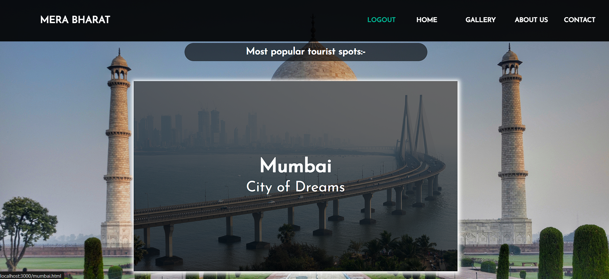

# Mera Bharat Tourism Website

Mera Bharat is an online travel booking website that allows users to book tickets for various destinations across India. This project includes user registration, login functionality, and booking capabilities using Node.js, Express, and MongoDB.

## Screenshots

### Home Page (Index)





### Mumbai Destination Page


### Booking Page


### Payment Page


## Features

- **User Registration**: Users can register with a unique username and password.
- **User Login**: Registered users can log in and access the booking functionality.
- **Booking**: Users can book tickets by providing personal and payment details.
- **Responsive Design**: The website is designed to be responsive and user-friendly.

## Using Your Own Images

Due to the large size of the image files, the `img` folder has not been included in this repository.

### How to Use Your Own Images

1. **Create an `images` Folder**: In the `public` directory of your project, create a new folder named `images`.

2. **Add Your Images**: Place your images inside this `images` folder.

3. **Ensure Filename Matches**: Make sure that the filenames of your images match those referenced in the code. If the code references `mumbai.jpg`, ensure there is a file with that exact name in the `images` folder.

### Example Structure

Your folder structure should look like this:

```plaintext
public/
├── images/
│   ├── home/
│   ├── ├── taj.jpg
│   ├── ├── background.jpg
│   ├── mumbaiImages/
│   ├── ├── mumbai1.jpg
│   ├── ├── mumbai2.jpg
│   ├── ladakhImages/
│   ├── ├── leh1.jpg
│   ├── ├── leh2.jpg
---others---
│   └── tick.gif

```

## Installation

### Prerequisites

- Node.js
- npm (Node Package Manager)
- MongoDB

##Technologies Used

###Node.js: JavaScript runtime environment.
###Express.js: Web framework for Node.js.
###MongoDB: NoSQL database.
###Mongoose: ODM library for MongoDB.
###HTML/CSS: For front-end structure and styling.

##License

This project is licensed under the MIT License.

